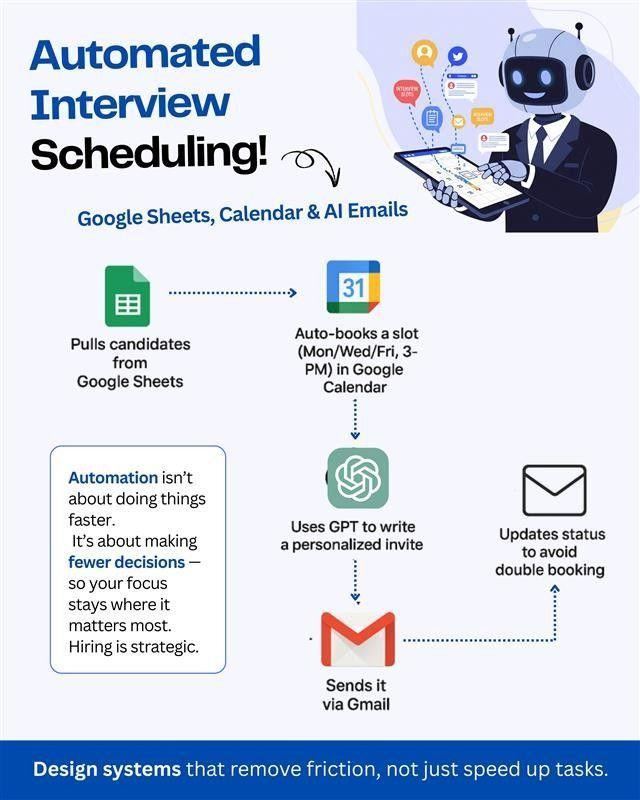

# 🤖 AI-Powered Recruitment & Hiring Platform

An end-to-end AI-powered recruitment automation platform built using **n8n** to streamline the hiring lifecycle. The system automates candidate registration, resume evaluation, shortlisting, interview scheduling, and recruitment tracking while keeping HR in control of final hiring decisions.

---

## ✨ Poster





## 🚀 Features

- 📄 Automated candidate registration through Google Forms
- 📂 Resume collection and storage in Google Drive
- 📑 Automatic PDF resume extraction
- 🤖 AI-powered resume evaluation using OpenAI
- 📊 Candidate scoring and shortlisting
- 📋 Candidate data management with Google Sheets
- 📧 Automated email notifications
- 📅 Interview scheduling using Google Calendar *(In Progress)*
- 📈 Recruitment analytics and reporting *(Planned)*

---

## 🛠️ Tech Stack

- **n8n** – Workflow Automation
- **OpenAI API** – Resume Analysis & Evaluation
- **Google Forms** – Candidate Registration
- **Google Sheets** – Candidate Database
- **Google Drive** – Resume Storage
- **PDF Extractor** – Resume Parsing
- **Gmail API** – Email Notifications
- **Google Calendar API** – Interview Scheduling

---

## 🏗️ Workflow Architecture

```text
Candidate
    │
Google Form
    │
Google Sheets Trigger
    │
Google Drive
    │
Download Resume
    │
Extract Resume Text
    │
OpenAI Resume Evaluation
    │
Structured Output Parser
    │
Candidate Score Generation
    │
Google Sheets Update
    │
Decision Making
   ├──────────────┐
   │              │
Shortlisted    Rejected
   │              │
Gmail         Gmail
   │
Google Calendar
```

---

## 📋 AI Evaluation Criteria

The AI evaluates resumes based on:

- Technical Skills
- Experience
- Education
- Relevant Projects
- Job Description Matching
- Overall Resume Quality

It generates:

- Match Score (0–100)
- Resume Summary
- Extracted Skills
- Experience Summary
- Hiring Decision
- Recommendation

---

## 📁 Project Structure

```
Recruitment-Automation/
│
├── workflows/
│   ├── Candidate Registration
│   ├── Resume Evaluation
│   ├── Candidate Shortlisting
│   ├── Interview Scheduling
│   └── Recruitment Analytics
│
├── assets/
│
└── README.md
```

---

## 🔄 Current Workflow

- Candidate submits application
- Resume uploaded to Google Drive
- Resume downloaded automatically
- PDF content extracted
- OpenAI analyzes resume
- AI generates score and recommendation
- Candidate database updated
- HR reviews shortlisted candidates

---

## 🎯 Future Enhancements

- AI Interview Feedback Analysis
- Offer Letter Generation
- Duplicate Candidate Detection
- Recruitment Dashboard
- Skill Gap Analysis
- Multi-Agent Recruitment System
- HR Analytics Dashboard
- Candidate Ranking

---

## 📸 Demo


---

## 👩‍💻 Author

**Shreyanshi Bangatia**

B.Tech Mathematics & Computing

AI Engineering Intern | IIT Jammu

---

## 📄 License

This project is developed for educational purposes as part of an AI Automation Capstone Project.
