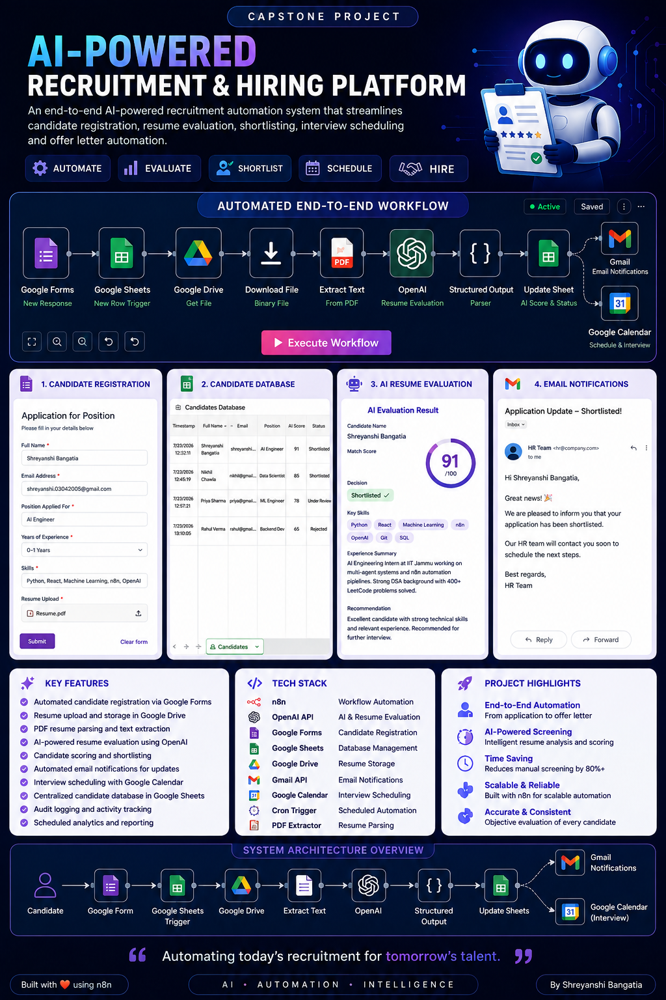
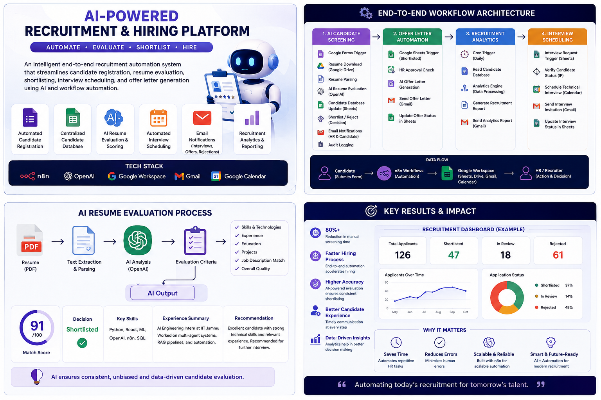
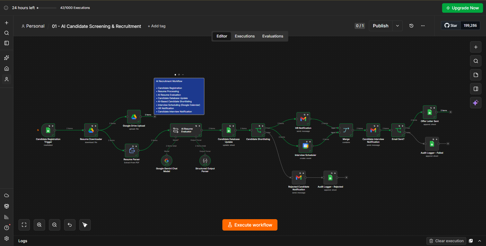
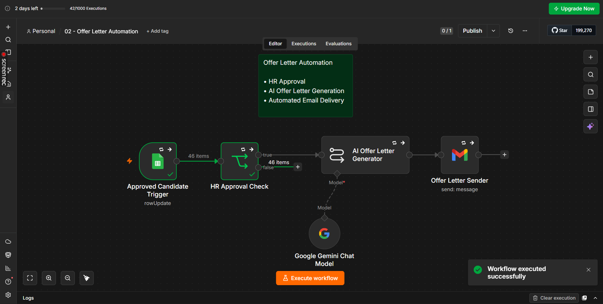
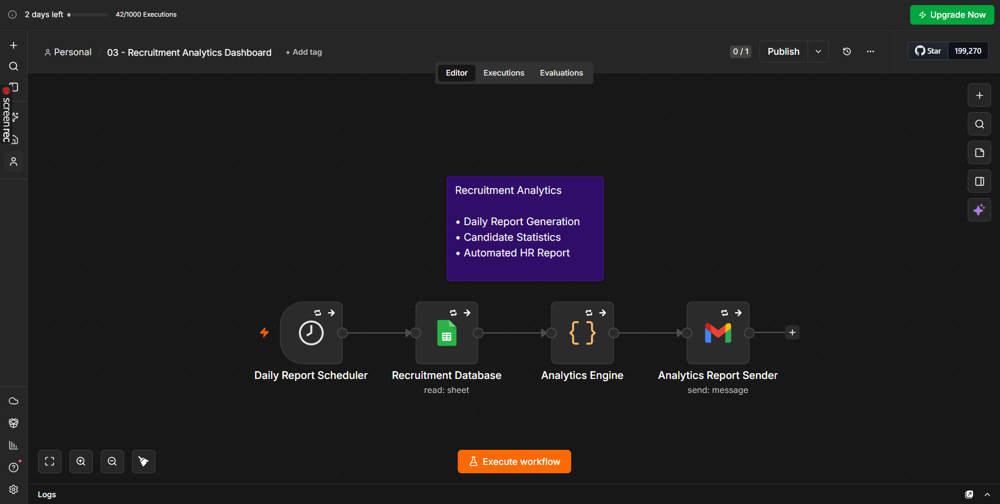
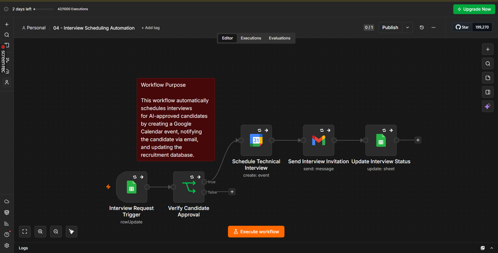

# 🤖 AI-Powered Recruitment & Hiring Platform

An end-to-end AI-powered recruitment automation platform built using **n8n** to streamline the hiring lifecycle. The system automates candidate registration, resume evaluation, shortlisting, interview scheduling, and recruitment tracking while keeping HR in control of final hiring decisions.

---

## ✨ Poster






## 🚀 Features

- 📄 Automated candidate registration through Google Forms
- 📂 Resume collection and storage in Google Drive
- 📑 Automatic PDF resume extraction
- 🤖 AI-powered resume evaluation using OpenAI
- 📊 Candidate scoring and shortlisting
- 📋 Candidate data management with Google Sheets
- 📧 Automated email notifications
- 📅 Automated Interview Scheduling using Google Calendar
- 📄 AI-powered Offer Letter Generation
- 📧 Automated Candidate & HR Email Notifications
- 📈 Daily Recruitment Analytics Dashboard
- 📊 Automated Recruitment Reporting

---

## 🛠️ Tech Stack

- **n8n** – Workflow Automation
- **OpenAI API** – Resume Analysis & Evaluation
- **Google Forms** – Candidate Registration
- **Google Sheets** – Candidate Database
- **Google Drive** – Resume Storage
- **PDF Extractor** – Resume Parsing
- **Gmail API** – Email Notifications
- **Google Calendar API** – Interview Scheduling
- Google Calendar API – Interview Scheduling
- Cron Trigger – Automated Analytics
- Google Gemini / OpenAI – AI Resume Evaluation & Offer Letter Generation
- JavaScript Code Node – Recruitment Analytics

---

## 🏗️ Workflow Architecture

```text
Candidate
      │
Google Form
      │
Google Sheets Trigger
      │
Resume Download
      │
Resume Parsing
      │
AI Resume Evaluation
      │
Candidate Database Update
      │
Candidate Shortlisting
      │
      ├───────────────┐
      │               │
Rejected          Shortlisted
      │               │
Rejection Email   HR Notification
                      │
                      ▼
             Interview Scheduling
             (Google Calendar)
                      │
             Interview Invitation
                      │
             HR Approval
                      │
             Offer Letter Generation
                      │
             Offer Letter Email
                      │
         Recruitment Analytics (Cron)
```

---

## 📋 AI Evaluation Criteria

The AI evaluates resumes based on:

- Technical Skills
- Experience
- Education
- Relevant Projects
- Job Description Matching
- Overall Resume Quality

It generates:

- Match Score (0–100)
- Resume Summary
- Extracted Skills
- Experience Summary
- Hiring Decision
- Recommendation

---

## 📁 Project Structure

```
Recruitment-Automation/
│
├── workflows/
│   ├── Candidate Registration
│   ├── Resume Evaluation
│   ├── Candidate Shortlisting
│   ├── Interview Scheduling
│   └── Recruitment Analytics
│
├── assets/
│
└── README.md
```

---

## 🔄 Current Workflow

- Candidate submits application
- Resume automatically downloaded
- Resume parsed
- AI evaluates resume
- Candidate score generated
- Candidate database updated
- Candidate shortlisted or rejected
- HR notified
- Interview scheduled automatically
- Google Calendar event created
- Interview invitation email sent
- HR approves candidate
- AI generates offer letter
- Offer letter emailed
- Daily recruitment analytics report generated

---

## 🎯 Future Enhancements

- AI Interview Feedback Analysis
- Candidate Ranking Dashboard
- Power BI Recruitment Dashboard
- WhatsApp Notifications
- Slack/MS Teams Integration
- Duplicate Candidate Detection
- Recruitment Dashboard
- Skill Gap Analysis
- Multi-Agent Recruitment System
- HR Analytics Dashboard
- Candidate Ranking

---

## 📸 Demo










---

## 👩‍💻 Author

**Shreyanshi Bangatia**

B.Tech Mathematics & Computing

AI Engineering Intern | IIT Jammu

---

## 📄 License

This project is developed for educational purposes as part of an AI Automation Capstone Project.
